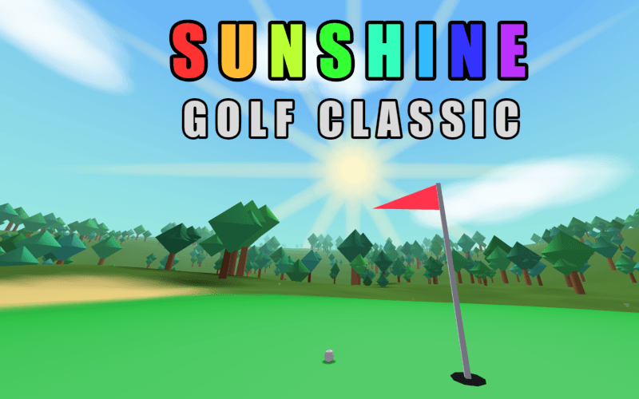

# ☀️⛳ Sunshine Golf Classic

# [PLAY ENHANCED VERSION](https://killedbyapixel.github.io/Golf13K/) - [OFFICIAL JS13K PAGE](https://js13kgames.com/games/sunshine-golf-classic)

An 18 hole golf course in real 3D, in under 13 kilobytes! Every hole is built from a seed the moment you tee off: the land, the trees, the weather, even the music. The renderer and every pixel of the art fit in there too.

Shoot par or better on the classic to unlock remix mode, and get a brand new course every time you play.

Best in Chrome, great on phones too. Created by Frank Force for JS13k 2026

## 🕹️ Controls

- Click or tap anything on screen. The chips above the meter set club, spin and distance, and the side arrows turn you.
- Click the view to see where the shot will land.
- Keyboard: arrows or WASD to aim, up and down to change club, Space to swing. The wheel sets distance.

## ⛳ How to Play

1. Aim with the arrows. A faint line draws the shot before you take it and the ring marks where it will land.
2. Set the distance, then click once to start the meter. Click again to set the power: it bounces off the top, so you get two passes at it.
3. Click a third time in the white band to strike it clean. Too early is a slice, too late is a hook.

Tips...

- The preview never shows the wind, so the arrow and the mph are yours to read.
- Backspin angles higher and stops fast, topspin angles lower and rolls farther.
- Aim past the hole on a putt, because short never goes in.
- Water and out of bounds cost a stroke. At 5 over par you pick up and move on.

## 🌈 Features

- 18 hole classic course, plus endless remix courses
- Real 3D terrain with hills, lakes, island greens and forests, drifting from spring meadow to fall sunset as you play
- Wind you can see: it bends shots, rolls waves and sways trees
- Real flight physics with drag, lift, backspin and topspin
- An 11 club bag, starring the mighty 13 iron
- Flyover hole intros, chase cam and a landing preview
- Sun rays, lens flare, rainbow trails and confetti
- Procedural music and ZzFX sound effects
- Autosaves every shot and tracks your best rounds

All rights reserved — this code is here to be played and judged, not reused.
See [LICENSE](LICENSE). The [LittleJS](https://github.com/KilledByAPixel/LittleJS)
engine itself remains MIT licensed in its own repository.
